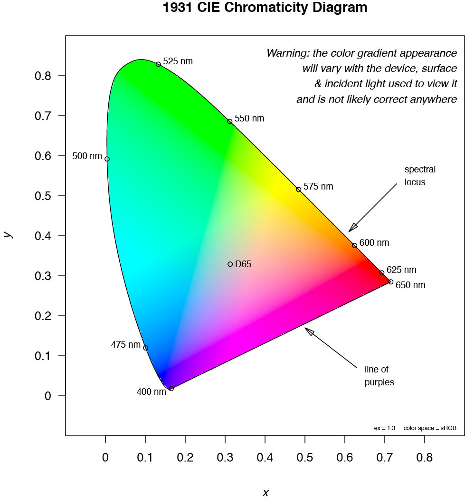

---
title: "Palette tools v1.0"
author: Giuseppe D'Agostino
output:
    html_document:
        toc: true
        toc_float: true
        theme: 'cosmo'
        highlight: 'tango'
        code_folding: show
        df_print: paged
---

 <br>
 <a href = "https://gdagstn.github.io/index.html">Back to the index page.</a>
 <br>

# Intro

This is a set of tools to do the following: check how a color palette performs in terms of luminance; check how it performs in various scenarios; produce a clustered color palette given a number of colors, a colorspace, a gamut and a clustering method; rotate the colors in a 2D or 3D space to slightly change them maintaining their distances.
<br>

<br>

# Available resources

There is a wealth of websites and R packages that allow to analyze color, move it across colorspaces, select optimized palettes from a picture or generate these palettes from scratch. Here are a few:

<ol>
<li> `qualpalr` by Johan Larsson (<a href = "https://cran.r-project.org/web/packages/qualpalr/vignettes/introduction.html" target = "_blank">vignette</a>): generates most distant colors given a number and a colorspace </li>
<li> `paletter` by Andrea Cirillo (<a href = "https://datascienceplus.com/how-to-use-paletter-to-automagically-build-palettes-from-pictures/" target = "_blank">blog post</a>): generates palettes using k-means on colors retrieved from a user-supplied jpeg</li>
<li> `SpecHelpers` by Bryan Hanson (<a href = "https://github.com/bryanhanson/SpecHelpers" target = "_blank">github page</a>):  useful datasets and instruments for color analysis and colorspace conversions</li>
<li>`colorspace` by Ross Ihaka, Paul Murrell, Kurt Hornik, Jason C. Fisher, Reto Stauffer and Achim Zeileis (<a href = "https://cran.r-project.org/web/packages/colorspace/index.html" target = "_blank">CRAN page</a>): many functions for colorspace conversion</li>
<li> `colorscience` by Jose Gama and Glenn Davis (<a href = "https://cran.r-project.org/web/packages/colorscience/index.html" target = "_blank">CRAN page</a>): many functions for colorspace conversion</li>
<li> `colordistance` by Hannah Weller (<a href = "https://cran.r-project.org/web/packages/colordistance/vignettes/color-spaces.html" target = "_blank">vignette</a>): projects colors to various spaces, calculates distances, with very nice documentation</li>
<li>The "I want hue" <a href = "http://tools.medialab.sciences-po.fr/iwanthue/" target = "_blank">webpage</a> by Mathieu Jacomy
</ol>

<br>

**If everything's already there, why bother doing more?**
<br>
The point of this markdown is to show R coding exercises to implement ideas coming from some of the resources above, mostly "I Want Hue", and possibly extend them. It is actually just for fun, and learning many new concepcts and techniques about color science, clustering, and geometry.
I think it is useful, both for me as a future reference and for the reader, to go through the thought processes behind these results with extensive annotations and explanations, also showing what didn't work (bar programming errors!). This way a reader can easily understand why some choices were made, and how they were implemented, and I can go back to my code and quickly understand what I was thinking, and find room for improvement.

<br>

**Continuous palettes**
<br>
To map a continuous variable to a color palette it is important to use an ordered set of colors that is perceptually uniform, i.e. with linear changes in luminance. `ColorRampPalette` palettes are usually perceptually uniform, but may be slightly boring. Other color palettes that are widely used (e.g. rainbow palette) can exaggerate differences between close values due to their erratic luminance profile. The `viridis` package has 4 perceptually uniform palettes that are not just color ramps, and make for nice visualizations in heatmaps, heatscatters and other types of visualization where colors map to continuous variables.
On the other hand, such a palette is ill suited for unique labels such as the ones we would use to identify different samples (barplots, boxplots) or clusters (PCA, tSNE, UMAP).

We first load the viridis library and a table with the coordinates for 2 tSNE components:

```{r }
require(viridis)
tsne <- read.delim("tsnecoords.tab.bin", header = T, stringsAsFactors = F)
tsne <- tsne[,4:5]
```
# Diagnostic tools

## Luminance inspector - `luminate`

We then define the first function, `luminate`, which shows the luminance and brightness profiles for the ordered set of colors in the palette, together with the palette itself and color names (or HEX values). The desaturate argument can be used to check for the same characteristics in a grayscale format, using the function `desaturate` from the `colorspace` <a href = "https://www.rdocumentation.org/packages/colorspace/versions/1.3-2" target = "_blank">package</a>.

```{r }
#' Luminance and brightness profile of color palettes
#' Plots colors with their brightness and luminance values
#' @param colors vector of characters with the colors to plot
#' @param cex numeric indicating the text size for color labels. Defaults to 2
#' @param desaturate logical: should colors be desaturated (converted to grayscale)? Defaults to \code{FALSE}
#' @return A plot of a color palette with their brightness and luminance values, the colors themselves and their color names. Color names are plot only if length(colors) <= 20, and dots are shown only if length(colors) <= 50.
#' @author Giuseppe D'Agostino
#' 
luminate <- function(colors, cex = 2, desaturate = F)

	{
		require(colorspace) #Require to load the "colorspace" library
		if(desaturate == T)
		{
			colors = colorspace::desaturate(colors) 
		}

		l <- length(colors)
		lums <- rep(0,l) #make a vector replicating number 0 
						 #as many times as there are colors
		for (i in 1:l)
		{
			lums[i] <- col2rgb(colors[i])[1]*0.299 + col2rgb(colors[i])[2]*0.587 + col2rgb(colors[i])[3]*0.114 #take luminance value by applying simple conversions to RGB
		}

		brightness <- rep(0,l)
		for (i in 1:l)
		{
			brightness[i] <- col2rgb(colors[i])[1]*0.2126 + col2rgb(colors[i])[2]*0.7152 + col2rgb(colors[i])[3]*0.0722 #take brightness value by applying simple conversions to RGB
		}

		ytop <- max(range(c(-60,range(lums), range(brightness))) + 30) #determine the maximum Y of the plot: start at -60 (to include colors in the bottom) then add 30 for annotations on top

		plot( 								#Blank plot that will be populated by lines and points
			x = 1:l, 
			y = rep(-15,l),
			ylim = c(-60,ytop), 
			cex = cex, 
			pch = 15, 
			col = colors, 
			xaxt = "n", 
			yaxt = "n",
			ylab = "luminance and brightness", 
			xlab = NA, 
			bty = "n", 
			main = paste("Lightness profile, n = ", l, sep = "")
			) 
		lines( 								#Luminance lines
			x = 1:l,
			y = lums
			)
		lines(   							#Brightness lines
			x = 1:l,
			y = brightness,
			col = "gray"
			)
		if(l <= 50)
		{
			points( 						#Luminance dots (only if there are less than 50 colors for display purposes)
				x = 1:l,
				y = lums,
				pch = 16,
				col = colors,
				)
			points( 						#brightness dots 
				x = 1:l,
				y = brightness,
				pch = 17,
				col = colors
				)
			legend(							#Show a legend with dots only if the dots are being plotted
				"top", 
				bty="n", 
				lwd=1, 
				col=c("black", "gray"), 
				pch=c(16, 17), 
				legend=c("Luminance", "Brightness")
				)
		}
		else if(l > 50)
		{
			legend(							#Legend without dots for more than 50 colors
				"top", 
				bty="n", 
				lwd=1, 
				col=c("black", "gray"), 
				legend=c("Luminance", "Brightness")
				)
		}

		ticks <- seq(0, max(lums), by = 20)	#Ticks on the plot and color names on the x axis
		axis(2, at=ticks, labels=ticks)
		if (l <= 20) 
			{
				text(labels = colors, srt = 90, x = 1:l, y = -50, cex = 0.7)	
			}
		
	}
```
Let's look at the `luminate` output of the viridis "C" palette:

```{r,fig.width=10, fig.height=10, dpi = 100 }
luminate(viridis(20, option ="C"))
```
And now with desaturation (notice how luminance and brightness are overlapping):

```{r,fig.width=10, fig.height=10, dpi = 100 }
luminate(viridis(20, option ="C"), desaturate = T)
```

Let's now look at the `luminate` output of the rainbow palette:

```{r,fig.width=10, fig.height=10, dpi = 100 }
luminate(rainbow(n = 20))
```
And with desaturation:

```{r,fig.width=10, fig.height=10, dpi = 100 }
luminate(rainbow(n = 20), desaturate = T)
```

## Multiplot inspector - `multiplottest`

Even though perceptually uniform palettes are very important for continuous variables, they are not ideal for distinguishing samples in barplots, boxplots, line charts or in 2D representations in which clusters are important, such as tSNE plots from single cell data.

We write another function, `multiplottest`, that shows how a palette performs in various use cases using simulated data and real single cell data.
This function simulates values for a barplot, a heatmap, some line graphs and uses a tSNE plot from a real single cell dataset. In the tSNE plot, clusters are artificially created by hierarchical clustering on the tSNE coordinates, so that we always have 1 cluster per color.

```{r}
#' Multi plot test for color palettes
#' A panel with 4 plots (barplot, line chart, heatmap and tSNE) coloured with a user-supplied palette
#' @param colors vector of characters with colors
#' @param randomize logical: should the order of colors in the palette be randomized? Only applies to barplot and line chart. Defaults to \code{FALSE}
#' @return 4 plots with the supplied colors.
#' @author Giuseppe D'Agostino


multiplottest <- function(colors, randomize = F)
{
	layout(matrix(1:4, nrow = 2))	#Open a 2x2 layout
	if(randomize == T)
		{
			 #First plot: barplot
			barplot( 									  
				sample(1:length(colors), length(colors)),  #As a vector of values to plot, take as many random integers as there are colors, between 1 and the number of colors 
				 col = colors[sample(1:length(colors), length(colors), replace = F)],    #If randomize is TRUE, colors will be shuffled using the sample function without replacement
				 border = NA
					)
		}
	else
		{
			barplot(
				sample(1:length(colors), length(colors)), 
				col = colors, 
				border = NA
					)
		}
	#Second plot: heatmap
	hmap = matrix(
		rep(0,length(colors)*length(colors)), #Generate a square matrix so that number of rows = number of columns = number of colors
		ncol = length(colors)
				) 

	for(i in 1:length(colors)) 
		{
			hmap[,i] = runif(length(colors), i, i*3)  #Using a loop that increments i from 1 to the total number of columns, populate the heatmap with values drawn from a random uniform distribution between the index i and i * 3.
		}

	hr = hclust( 				#Hierarchical clustering of the rows
		as.dist(hmap), 
		method="complete"
				)

	hc = hclust( 	  			#Hierarchical clustering of columns (same as rows but transposing the matrix so that rows and columns are exchanged)
		as.dist(t(hmap)), 
		method="complete"
				)

	hm2 = as.matrix(hmap[hr$order, hc$order]) #Reorder the matrix according to hierarchical clustering of both rows and columns

	image( 						#Draw the heatmap using image, plotting the semi-random numbers in the matrix using the input colors. The matrix is transposed because image rotates the matrix by 90 degrees. 
		t(as.matrix(hm2)), 
		col = colors, 
		xaxt = "n", 
		yaxt = "n"
		) 

	#Third plot: line chart

	plot( 						#Blank plot 
		x = 1:length(colors), 
		y = rep(10, length(colors)), 
		col = colors[1], 
		cex = 0, 
		ylim = c(0, length(colors)+3), #The y limit is set between 0 and the number of colors plus an overhang
		xlab = NA, 
		ylab = NA
		)

	if(randomize == T)
	{
		randomcols = colors[sample(1:length(colors), length(colors))] 
		for(i in 1:length(colors)) 
			{
				lines(x = 1:length(colors), 
					y = runif(length(colors), i, i+2.5), 
					col = randomcols[i], 
					lwd = 2)
			}
	} 
	else 
	{
		for(i in 1:length(colors)) 
			{
				lines(x = 1:length(colors), 
					y = runif(length(colors), i, i+2.5), 
					col = colors[i], 
					lwd = 2)
			}
	}

	#Fourth plot: tSNE (takes a data frame as input containing X and Y coordinates (actually tSNE 1 and tSNE 2))
	tmp = dist(tsne) 						#Calculate distances of all points in the tSNE
	hc = hclust(tmp) 						#Perform hierarchical clustering on the distances of every dot
	cutt = cutree(hc, k = length(colors))	#Cut the tree so that dots are separated in a number of clusters = number of colors
	dat = as.data.frame(cbind(tsne,cutt))	#Add the clustering assignment to the tSNE coordinates

	plot(dat[,1],  						    #Plot the tSNE assigning a color to each cluster
		dat[,2], 
		col = colors[dat[,3]], 
		pch = 16,
		xlab = NA, 
		ylab = NA)

}
```
We can see how viridis palettes perform well for heatmaps, but not for any other categorical variable

```{r,fig.width=10, fig.height=10, dpi = 100 }
multiplottest(viridis(25, option = "D"))
```
*Categorical palettes*
Whereas a categorical palette (taken from <a href = "https://sashat.me/2017/01/11/list-of-20-simple-distinct-colors/" target = "_blank">here</a>) is very good for categorical variables, but horrible for heatmaps:

```{r,fig.width=10, fig.height=10, dpi = 100 }

uniquecols =c("#e6194B", "#3cb44b", "#ffe119", "#4363d8", "#f58231", "#911eb4", "#42d4f4", "#f032e6", "#bfef45", "#fabebe", "#469990", "#e6beff", "#9A6324", "#fffac8", "#800000", "#aaffc3", "#808000", "#ffd8b1", "#000075", "#a9a9a9") 

multiplottest(uniquecols)
```
Notice that we removed black and white colors from the original palette.

# Palettes by color space clustering


There are some interesting ways to generate palettes with diverse colors automatically. There's more than a century of theoretical and experimental research on how colors are perceived and what color spaces can be constructed based on changes in color components. 
As an interesting experiment that resulted in a useful tool, <a href = "http://tools.medialab.sciences-po.fr/iwanthue/theory.php" target = "_blank"> Mathieu Jacomy </a> at the Sciences Po Média Lab developed unique palettes using clustering on color spaces. As an exercise and in order to port some of his results to R, I will try to reproduce his workflow just by looking at how he developed it.

## Clustering in RGB

Let's first build the simplest color space, RGB. The RGB color space is a cube drawn by stepwise increments in R, G and B values.
RGB values are interpreted by R in the 0 - 1 interval, whereas they are normally defined between 0 and 255, so they will need to be converted.
We can populate a 3D array with a simple loop, which is feasible for small numbers of steps (in our case, 64).

```{r}
rgbmat = array(0, dim = c(64,64,64)) #Generate a 3-dimensional array of 64 x 64 x 64
for(i in 1:64)  					 #Three nested for-loops to populate the array. For 64 steps this is still feasible, but it is actually very bad programming as for loops are slow, and nested for loops are even slower.
{
	for(j in 1:64)
	{	
		for(q in 1:64)
		{
		rgbmat[i,j,q] = rgb( 						#Populate the array: add a different RGB triplet (will be converted to HEX) for 1/64th increments to each R, G and B value
			seq(0,255,length.out = 64)[i]/255, 
			seq(0,255,length.out = 64)[j]/255, 
			seq(0,255,length.out = 64)[q]/255
			)
	}
	}
}
```
To simplify plotting the 3D matrix, we `melt` (from `reshape2`) into a long format with 3 variables, which will be our X, Y and Z:

```{r}
mm = reshape2::melt(rgbmat) #melt converts a matrix into a long format, i.e. in this case each point in each dimension is divided into its coordinates so that we have all triplets of X, Y, Z and the corresponding color value

mm$value = as.character(mm$value) #the value in melt is a factor, but for plotting we need to convert it to a character
mmsampled = mm[sample(1:nrow(mm), size = 30000, replace = F),] #Take 50000 random points from the cube for speedy plotting

```
We can now visualize the cube using `scatter3d` from the `plot3D` package:

```{r, eval = F, echo = T}
layout(matrix(1:2, nrow = 1)) 
plot3D::scatter3D(mmsampled[,1],mmsampled[,2],mmsampled[,3], colvar = NULL, col = as.character(mmsampled$value))   
plot3D::scatter3D(mmsampled[,1],mmsampled[,2],mmsampled[,3], colvar = NULL, col = as.character(mmsampled$value), theta = 180) #Rotate around the azimuthal direction
```

<center></center>

Notice how on one diagonal of the cube (from black vertex to white vertex, i.e. from RGB(0,0,0) to RGB(1,1,1) lies the grayscale:
<br>

```{r,fig.width=5, fig.height=5, dpi = 100 }
diagonal = 1:64 #The diagonal of a 64x64x64 cube will be made by every dot that increments by 1 all the dimensions at the same time: (1,1,1), (2,2,2), (3,3,3), etc.
diagcol = vector()
for(i in 1:64) 
	{
		diagcol[i] = mm[which(mm[,1] == diagonal[i] & mm[,2] == diagonal[i] & mm[,3] == diagonal[i]),4] #match colors to coordinates that correspond to the diagonal 
	}
plot3D::scatter3D(diagonal, diagonal, diagonal, colvar= NULL, col = diagcol, pch = 16)
```
<br>
We can now apply k-means clustering (using the function `kmeans` from the `stats` package) to cluster the 3D space in k subspaces, of which we will take the colors lying at the coordinates defined by cluster centroids. Importantly, k-means center coordinates must be rounded so that we can find them again in our original 3D array. This will generate some approximations. Let's start with 8 different colors:
<br>

```{r}
km = stats::kmeans(mm[,1:3], centers = 8) #k-means is applied to a space in any dimension. We want to identify 8 colors, so we set k = 8.
rkm = round(km$centers[,1:3]) #We take the centers slot from the k-means object (a list), and we round it to find the corresponding coordinate 
kmcols = vector()
for(i in 1:8)	
	{
		kmcols[i] = mm[which(mm[,1] == rkm[i,1] & mm[,2] == rkm[i,2] & mm[,3] == rkm[i,3]),4] #Match coordinates to colors in the RGB space
	}
```

The colors will be inside the cube, but where are they exactly? Notice how in a cubic space k-means reproduces a cube.

```{r,fig.width=10, fig.height=5, dpi = 100 }
layout(matrix(1:2, nrow = 1))
plot3D::scatter3D(rkm[,1], rkm[,2], rkm[,3], colvar= NULL, col = as.character(kmcols), pch = 16, xlim = c(0,64), ylim = c(0,64), zlim = c(0,64), cex =3)
plot3D::scatter3D(rkm[,1], rkm[,2], rkm[,3], colvar= NULL, col = as.character(kmcols), pch = 16, xlim = c(0,64), ylim = c(0,64), zlim = c(0,64), cex =3, theta = 180)

```

Let's see how the clustering performed:

```{r,fig.width=10, fig.height=10, dpi = 100 }
multiplottest(kmcols)
```

These colors are quite distinguishable, but elicit a mixed feeling of despair and nostalgia.

We can try another clustering method, `CLARA`, from the `cluster` package. CLARA uses partitioning around medoids (PAM) after a random sampling of the space. Notice that since this method uses medoids, which are actual points in the space, we don't need to round them to find the points in the array.

```{r,fig.width=10, fig.height=10, dpi = 100 }

claram = cluster::clara(mm[,1:3], k = 8) #The syntax of clara is the same as k-means
	claram = claram$medoids #Take medoids from the clara object
	clcols = vector()
	for(i in 1:8)	
		{
			clcols[i] = mm[which(mm[,3] == claram[i,1] & mm[,1] == claram[i,2] & mm[,2] == claram[i,3]),4]
		}

```
Let's see our new colors in the cube:

```{r,fig.width=10, fig.height=5, dpi = 100 }
layout(matrix(1:2, nrow = 1))
plot3D::scatter3D(claram[,1], claram[,2], claram[,3], colvar= NULL, col = as.character(clcols), pch = 16, xlim = c(0,64), ylim = c(0,64), zlim = c(0,64), cex = 3)
plot3D::scatter3D(claram[,1], claram[,2], claram[,3], colvar= NULL, col = as.character(clcols), pch = 16, xlim = c(0,64), ylim = c(0,64), zlim = c(0,64), cex = 3, theta = 180)

```

Colors are still inside the cube, but not as evenly distributed as in k-means. Let's see how this palette performs:

```{r,fig.width=10, fig.height=10, dpi = 100 }
multiplottest(clcols)
```

Much more astethically pleasing than k-means.

## Clustering colors in CIE 1931 space 


However, the RGB space is not perceptually uniform, and may generate colors that are not ideal for their differences (or similarities). 
For this reason, it may be much better in terms of perceptuality and pleasantness of the colors to use the CIE XYZ 1931 color space. It is still not completely perceptually uniform (whereas CIE Lab 1976 is more perceptually uniform), but can be used in practice for color definition.
An important caveat about the representation on monitors of colorspaces is that, even if the colorspace spans a certain array of values, devices can only faithfully display a subspace of this array. This subspace is called the gamut of the colorspace.
The CIE 1931 colorspace is a 3-dimensional space, but for visualization purposes we flatten it by keeping a constant luminance value, and plotting the other components.
A very handy package,  `SpecHelpers`, contains data and functions to draw the CIE 1931 chromaticity diagram for a given exposure (luminance) value.
We  tart by plotting the CIE 1931 chromaticity diagram using the `plotCIEchrom` function included in the package, using the sRGB colorspace and the exposure of 1.3. 
<br>

```{r,fig.show = "hide"}
library(SpecHelpers)
library(grid)
library(raster)
SpecHelpers::plotCIEchrom(gradient = "sl", colorspace = "sRGB", ex = 1.3)

```


The contour of the chromaticity diagram is drawn by the xy coordinates given by visible light, therefore is called the spectral locus. Colors lying on the spectral locus are "pure" colors, and they are very hard to render by devices. The rest of the colors within the diagram is obtained by making a gradient of colors from the spectral locus. The D65 point is the white reference, which influences the whole colorspace and changes with changes in luminance. 
This is the colorspace that we want to cluster in order to find centroids or medoids and obtain a unique palette, using an approach similar to the one developed for the RGB cube.
<br>
By looking into the code for `plotCIEchrom`, we find out how the object is constructed. The first operation is the definition of the spectral locus coordinates by looking up a table that contains CIE XYZ coordinates for any given wavelength between 390 and 830, in 1 nm increments. The function subsets this table by taking all the wavelengths below 650 nm.

```{r}
head(CIExyz)
keep <- which(CIExyz$wavelength <= 650)
Lxyz <- CIExyz[keep,]
```
The function then calls another function, `prepCIEgradient`, in which the diagram defined by Lxyz is filled with a gradient from the sRGB color space at a given exposure value. The way this is done is simple:

<ol>
<li>a matrix of x and y coordinates is prepared.</li>
<li>these coordinates are converted to a long format using `expand.grid`, in a way very similar to what `melt` does.</li>
<li>the third coordinate, z, is taken by subtracting x and y from 1.</li>
<li>the `inout` function is called to determine which points lie inside the chromaticity diagram, and which ones lie outside.</li>
<li>the `convertColor` function from `grDevices` is used to convert all XYZ coordinates into the sRGB color space.</li>
<li>values are adjusted for optimal plotting and a 3D array is created, which will be used to make the raster.</li>
</ol>

```{r}
ciegradient = SpecHelpers::prepCIEgradient(vertices = Lxyz, colSpace = "sRGB", ex = 1.2)
```

The `ciegradient` object is a raster, which - as happens for `image` or other plotting functions - is plotted by rotating the matrix by 90 degrees, anticlockwise. This means that to replot this object in base graphics the raster matrix must be transposed and inverted on the column component:

```{r}
ciedft = t(as.matrix(as.raster(ciegradient))) #step 1: rotate (transpose) the matrix
ciedf = ciedft[,ncol(ciedft):1] #step 2: invert it on the column component
```

We will now select the gamut on which the clustering will be performed. As mentioned earlier, the gamut is a subset of the colorspace that can be rendered by a particular device. The `SpecHelpers` package provides XYZ coordinates for several gamuts, such as "SWOP" (print CMYK), "sRGB", "NTSC", "Adobe", "Apple" and "CIE". The color gradient can be obtained in the same way as before, only specifying the coordinates of the gamut rather than the whole chromaticity diagram. We will use the "NTSC" gamut:

```{r}
	gamutv <-  SpecHelpers::getGamutValues("NTSC")
	gamutdft = t(as.matrix(as.raster(SpecHelpers::prepCIEgradient(vertices = gamutv, colSpace = "sRGB", ex = 1.2))))
	gamutdf = gamutdft[,501:1]
```	
We now `melt` both matrices, as we did for the cube RGB space, and exclude white (#FFFFFF) coordinates from the clustering:

```{r}
	ciemelt = reshape2::melt(ciedf)
	ciemelt$value = as.character(ciemelt$value)
	ciespace = ciemelt[which(ciemelt$value != "#FFFFFF"),] #exclude white dots (outside of the diagram)

	gamutmelt = reshape2::melt(gamutdf)
	gamutmelt$value = as.character(gamutmelt$value)
	gamutspace = gamutmelt[which(gamutmelt$value != "#FFFFFF"),]
```	

Now we have a set of coordinates that can be clustered and plotted easily. First attempt with k-means, 8 colors:

```{r}
gamutkm = stats::kmeans(gamutspace[,1:2], centers = 8)
	gamutkm = round(gamutkm$centers)
	colorvec1 = 1:8
	for(i in 1:8) 
		{
			colorvec1[i] = gamutspace[which(gamutspace[,1] == gamutkm[i,1] & gamutspace[,2] == gamutkm[i,2]),3]
		}
```	

Let's have a look at the resulting palette with `multiplottest`:

```{r,fig.width=10, fig.height=10, dpi = 100 }
multiplottest(colorvec1)
```

We can also visualize the colors on the colorspace, with some fancy annotations. Since XYZ coordinates are defined between 0 and 0.9, we have to rescale all coordinate values. The gamut is painted as a polygon using the convex hull of the points in the gamut. Color annotations are ordered by the y coordinate to avoid tangled lines.

```{r,fig.width=10, fig.height=10, dpi = 100 }
	#Plot the chromaticity diagram rescaling coordinates
	plot(
		(ciemelt[,1]/501)*0.9, 
		(ciemelt[,2]/501)*0.9, 
		col = ciemelt$value, 
		pch = 16, 
		cex = 0.2, 
		xlab = "x", 
		ylab = "y", 
		xlim = c(0,1), 
		main = "8 clustered colors on CIE 1931 colorspace")

	orderg = order(gamutkm[,2], decreasing = F) #Order colors by their Y component on the diagram
	gamutkm = gamutkm[orderg,] #Apply ordering to both dots and colors
	colorvec1 = colorvec1[orderg]

	polygon(					 #Plot a polygon showing the perimeter of the gamut by calculating the convex hull of all points in the gamut
		(gamutspace[chull(gamutspace[,1], gamutspace[,2]),1]/501)*0.9, 
		(gamutspace[chull(gamutspace[,1], gamutspace[,2]),2]/501)*0.9
		)

	text(					 	#Write color labels
		y = seq(0.1,0.8, length.out = 8), 
		x = rep(0.9, 8), 
		cex = 0.8, 
		labels = colorvec1)

	for(i in 1:8) 
		{					 	#For loop to draw lines connecting dots in the diagram to dots in the legend
			segments(
				x0 = (gamutkm[i,1]/501)*0.9, 
				y0 =(gamutkm[i,2]/501)*0.9, 
				x1 = 0.8, 
				y1 = seq(0.1,0.8, length.out = 8)[i], 
				lwd = 0.5
				)
		}

	points(					 	#Draw the dots on the chromaticity diagram using the "21" pch shape, so that it is filled with the color and has a black outline
		(gamutkm[,1]/501)*0.9, 
		(gamutkm[,2]/501)*0.9, 
		pch = 21, 
		bg = colorvec1, 
		col = "black"
		)

	text(					 	#Write on the plot information on the parameters used
		y = 0.9, 
		x = 0.1, 
		pos = 4, 
		cex = 0.7, 
		labels = "Gamut: NTSC, Exposure: 1.3, clustering method: kmeans"
		)

	points(					 	#Color plot legend on the side
		y = seq(0.1,0.8, length.out = 8), 
		x = rep(0.8, 8), 
		cex = 4, 
		pch = 21, 
		col = "black", 
		bg = colorvec1
		)

```

## `XYZ_clusterpalette`


Now let's package this in a handy function where we can decide the number of colors, the gamut, the clustering method and the exposure:

```{r}
#' XYZ Cluster Palette
#' Generates a clustered palette 
#' @param k numeric, number of colors to be generated
#' @param gamut character, defines the gamut on the CIE XYZ 1931 space. Must be one of "SWOP", "sRGB", "NTSC", "Apple", "CIE"
#' @param exposure numeric, the luminance of the colorspace
#' @param clusterMethod character, either of "CLARA" or "kmeans"
#' @param plot logical, should the plot on the colorspace be produced?
#' @return a vector of hex values for clustered colors, and optionally a plot
#' @author Giuseppe D'Agostino
#' 
XYZ_clusterpalette = function(k, gamut = "NTSC", exposure = 1.2, clusterMethod = "CLARA", plot = T)
{	


	keep <- which(CIExyz$wavelength <= 650) 
	Lxyz <- CIExyz[keep,]
	gamutv <-  SpecHelpers::getGamutValues(gamut)
	ciedft = t(as.matrix(as.raster(SpecHelpers::prepCIEgradient(vertices = Lxyz, colSpace = "sRGB", ex = exposure))))
	ciedf = ciedft[,501:1]
	gamutdft = t(as.matrix(as.raster(SpecHelpers::prepCIEgradient(vertices = gamutv, colSpace = "sRGB", ex = exposure))))
	gamutdf = gamutdft[,501:1]
	ciemelt = reshape2::melt(ciedf)
	ciemelt$value = as.character(ciemelt$value)
	ciespace = ciemelt[which(ciemelt$value != "#FFFFFF"),]
	rownames(gamutdf) = 1:nrow(gamutdf)
	colnames(gamutdf) = 1:ncol(gamutdf)
	gamutmelt = reshape2::melt(gamutdf)
	gamutmelt$value = as.character(gamutmelt$value)
	gamutspace = gamutmelt[which(gamutmelt$value != "#FFFFFF"),]

	if(clusterMethod == "kmeans")
	{
	gamutkm = stats::kmeans(gamutspace[,1:2], centers = k)
	gamutkm = round(gamutkm$centers)
	colorvec = vector()
	for(i in 1:k) colorvec[i] = gamutspace[which(gamutspace[,1] == gamutkm[i,1] & gamutspace[,2] == gamutkm[i,2]),3]
		}
			else if(clusterMethod == "CLARA")
		{
	gamutkm = cluster::clara(gamutspace[,1:2], k)
	gamutkm = gamutkm$medoids
	colorvec = gamutspace[rownames(gamutkm),3]
		}
			if(plot == T)
		{
	
	plot((ciemelt[,1]/501)*0.9, (ciemelt[,2]/501)*0.9, col = ciemelt$value, pch = 16, cex = 0.2, xlab = "x", ylab = "y", xlim = c(0,1), main = paste(k, "clustered colors on CIE 1931 colorspace"))

	orderg = order(gamutkm[,2], decreasing = F)
	gamutkm = gamutkm[orderg,]
	colorvec = colorvec[orderg]

	polygon((gamutspace[grDevices::chull(gamutspace[,1], gamutspace[,2]),1]/501)*0.9, (gamutspace[grDevices::chull(gamutspace[,1], gamutspace[,2]),2]/501)*0.9)
	
	text(y = seq(0.1,0.8, length.out = k), x = rep(0.9, k), cex = 0.8, labels = colorvec)
	for(i in 1:k) segments(x0 = (gamutkm[i,1]/501)*0.9, y0 =(gamutkm[i,2]/501)*0.9, x1 = 0.8, y1 = seq(0.1,0.8, length.out = 8)[i], lwd = 0.5)
	points((gamutkm[,1]/501)*0.9, (gamutkm[,2]/501)*0.9, pch = 21, bg = colorvec, col = "black")
	text(y = 0.9, x = 0.1, pos = 4, cex = 0.7, labels = paste("Gamut: ", gamut, ", Exposure: ", exposure, ", clustering method: ", clusterMethod, sep = ""))
	points(y = seq(0.1,0.8, length.out = k), x = rep(0.8, k), cex = 4, pch = 21, col = "black", bg = colorvec)

	}
	return(colorvec)
}
```

Now let's do a few test runs changing parameters:

```{r,fig.width=10, fig.height=10, dpi = 100 }
layout(matrix(1:4, nrow = 2))
XYZ_clusterpalette(8, gamut = "NTSC", clusterMethod = "CLARA")
XYZ_clusterpalette(8, gamut = "sRGB", clusterMethod = "CLARA")
XYZ_clusterpalette(8, gamut = "SWOP", clusterMethod = "kmeans")
XYZ_clusterpalette(8, gamut = "SWOP", clusterMethod = "kmeans", exposure = 1)
```

## Clustering in Lab space

The Lab color space, or 1976 CIE Lab color space, is more perceptually uniform than the XYZ space, meaning that colors that are close together in this space are going to appear very similar. The L, a and b coordinates represent Luminance (L), red-green (a) and blue-yellow (b). L goes from 0 to 100, while a and b depend on the gamut: for sRGB they are between -127 and 128.
We can get its structure by converting the RGB colors in our cube to Lab coordinates:

```{r, eval = F, echo = T}
mmlab = grDevices::convertColor(hex2RGB(mmsampled$value)@coords, from = "sRGB", to = "Lab")
layout(matrix(1:2, nrow = 1))
plot3D::scatter3D(mmlab[,2], mmlab[,3], mmlab[,1], col = rgb(grDevices::convertColor(mmlab, from = "Lab", to = "sRGB")), colvar = F, pch = 16)
plot3D::scatter3D(mmlab[,2], mmlab[,3], mmlab[,1], col = rgb(grDevices::convertColor(mmlab, from = "Lab", to = "sRGB")), colvar = F, pch = 16, theta = 180)
```
<center></center>

We now apply both k-means and CLARA in this space and look at the result:

```{r, fig.width=10, fig.height=5, dpi = 100 }
labkm = stats::kmeans(mmlab, centers = 8)
labkmc = labkm$centers
collabkm = rgb(grDevices::convertColor(labkmc, from = "Lab", to = "sRGB"))

labclara = cluster::clara(mmlab, k = 8)
labclaram = labclara$medoids
collabclm = rgb(grDevices::convertColor(labclaram, from = "Lab", to = "sRGB"))

layout(matrix(1:2, nrow = 1))
plot3D::scatter3D(labkmc[,2], labkmc[,3], labkmc[,1], col = collabkm, colvar = F, pch = 16, cex = 3, main = "K-means Lab")
plot3D::scatter3D(labclaram[,2], labclaram[,3], labclaram[,1], col = collabclm, colvar = F, pch = 16, cex = 3,  main = "CLARA Lab")
```

```{r, fig.width=10, fig.height=10, dpi = 100 }
multiplottest(collabkm)
multiplottest(collabclm)
```
Even though the space is perceptually uniform, the resulting palettes are not very visually pleasing.

# Rotating the clustered points

Although many parameters can be changed in this function, the coordinates of colors will tend to be the same. 
In order to generate slightly different colors in a controlled way (or random, if we feel lucky), an idea worth testing is rotating the whole matrix of 2D coordinates of the cluster centers around the center of the set of points. 
Let's first write a function to find the center:

```{r}
getCenter <- function(o)
{
	xy = 1:2
	xy[1] = mean(o[,1])
	xy[2] = mean(o[,2])
	return(xy)
}
```
And now let's write a function to rotate 2D matrices around a center. Rotations in the 2D space happen by applying two trigonometric functions to each component of the coordinates:

$$ x_{rotated} = x_{original} * cos(\theta) - y_{original} * sin(\theta) $$
$$ y_{rotated} = x_{original} * sin(\theta) + y_{original} * cos(\theta) $$

This is a rotation around the origin of the coordinates in a cartesian plane (0,0). To rotate around a specific point, we have to subtract the coordinates of the new center from the original X and Y, rotate, and add the coordinates again. $ \theta $ is the rotation angle, expressed in radians. The function will actually take degrees as input, and transform them into radians.

```{r}
#' Rotate 2D coordinates
#' Generates a 2D matrix rotated around a center by a defined angle
#' @param o matrix of coordinates to be rotated
#' @param theta numeric, angle of the rotation
#' @param centerc numeric, the coordinates of the center of rotation. defaults to (0,0)
#' @return a rotated coordinates matrix
#
rotate2Dcoords = function(o, theta, centerc = c(0,0))
{ 	
	a = o[,1]
	b = o[,2]
	rads = theta * (pi/180) #Transform angle in degrees to radians
	a = a - centerc[1]
	b = b - centerc[2]
    xr = a*cos(rads) - b*sin(rads)
    yr = a*sin(rads) + b*cos(rads)
    xr = xr + centerc[1]
    yr = yr + centerc[2]
    rotatedm = cbind(xr, yr) #Bind together the new rotated coordinates in a matrix
return(rotatedm)
}
```

Let's see how this function performs. We will first draw a black square of side 1 starting at (1,1) and going up to (2,2). Then we will rotate this square 45 degrees around the origin (red square), and then we will rotate it around its center (blue square), which we will obtain by applying `getCenter`.

```{r,fig.width=10, fig.height=10, dpi = 100 }
#Start by making an XY matrix with the first square coordinates
squarem = t(matrix(c(c(1,1), c(1,2), c(2,2), c(2,1)), nrow = 2)) 
plot(squarem[,1], squarem[,2], pch = 16, cex = 1, col = "black", ylim = c(-4,4), xlim = c(-4,4), xlab = "x", ylab = "y")
polygon(squarem[,1], squarem[,2], border = "black")
abline(h = 0)
abline(v = 0)
#Rotate around the origin
rot1 = rotate2Dcoords(squarem, theta = 45, centerc = c(0,0))
points(rot1[,1], rot1[,2], pch = 16, cex = 1, col = "red")
polygon(rot1[,1], rot1[,2], border = "red")
#Rotate around the center
rot2 = rotate2Dcoords(squarem, theta = 45, centerc = getCenter(squarem))
points(rot2[,1], rot2[,2], pch = 16, cex = 1, col = "blue")
points(getCenter(squarem)[1], getCenter(squarem)[2], col = "blue")
polygon(rot2[,1], rot2[,2], border = "blue")
```
## Rotating in CIE 1931

We can now apply these functions to our clustered color coordinates in the CIE 1931 space. We rotate them by 45 degrees again, and plot them as red dots. The rotation maintains the distance between dots, only changing their xy values within the gamut. Notice however that some of the rotated colors will fall out of the gamut, or even of the whole chromaticity diagram.

```{r,fig.width=10, fig.height=10, dpi = 100 }
#Get perimeter of the gamut
gamuthull = gamutspace[chull(gamutspace[,1:2]),1:2]

plot(gamutkm[,1], gamutkm[,2], xlim = c(0,500), ylim = c(0,500), xlab = "x", ylab = "y")
polygon(gamuthull[,1], gamuthull[,2], xlim = c(0,500), ylim = c(0,500), lty = 2)
rott = rotate2Dcoords(gamutkm, theta = 45, getCenter(gamutkm))
points(rott[,1], rott[,2], pch = 16, col = "red")
```
We still want to keep the colors in the gamut. To do this we need to isolate the dots that fall outside of the gamut, and find the nearest points within the gamut. This will generate somehow suboptimal distances, especially when rotations cause many dots to fall out; we have however all the tools we need to check what happens with various degrees of rotations.
The first thing to do is to find which points are out of the gamut, using the same function called in `getCIEgradient`:

```{r,fig.width=10, fig.height=10, dpi = 100 }
gamuthull = as.data.frame(gamuthull, stringsAsFactors = F)
colnames(gamuthull) = c("x","y")
outpts = splancs::inout(pts = rott, poly = gamuthull)
plot(gamutkm[,1], gamutkm[,2], xlim = c(0,500), ylim = c(0,500), xlab = "x", ylab = "y")
polygon(gamuthull[,1], gamuthull[,2], xlim = c(0,500), ylim = c(0,500), lty = 2)
rott = rotate2Dcoords(gamutkm, theta = 45, getCenter(gamutkm))
points(rott[,1], rott[,2], pch = 16, col = "red")
text(rott[,1], rott[,2], labels = outpts)
outrot = rott[outpts == F,]
```

In order to find the set of points in the gamut that are closest to the outlier rotated points we implement a k-nearest neighbor tree search from the SearchTrees package. We first create a tree for the coordinates of the gamut perimeter, then we use the knnLookup function to find the single nearest point (k = 1) using the k-nearest neighbor algorithm on the tree. We then plot the points in blue.

```{r,fig.width=10, fig.height=10, dpi = 100 }
library(SearchTrees)

gamuttree = createTree(as.matrix(gamutspace[,1:2])) #First create a tree of the whole space in which we want to find the closest point

inds = knnLookup(gamuttree, newdat = outrot, k=1)	#Lookup by k-nearest neighbors within the tree

plot(
	gamutkm[,1], 
	gamutkm[,2], 
	xlim = c(0,500), 
	ylim = c(0,500), 
	xlab = "x", 
	ylab = "y"
	)

polygon(
	gamuthull[,1], 
	gamuthull[,2], 
	xlim = c(0,500), 
	ylim = c(0,500), 
	lty = 2
	)

points(
	rott[,1], 
	rott[,2], 
	pch = 16, 
	col = "red"
	)

points(    				#These are the points found by knnLookup
	gamutspace[inds,1], 
	gamutspace[inds,2], 
	pch = 16, 
	col = "blue"
	)

```

Let's see how this rotations has worked: 

```{r,fig.width=10, fig.height=10, dpi = 100 }
ingamut = gamutspace[inds,1:2]
colnames(ingamut) = c("xr", "yr")
newcoords = rbind(rott[outpts ==T,], ingamut)
newcoords = round(newcoords)
colorvec2 = 1:8
	for(i in 1:8) colorvec2[i] = gamutspace[which(gamutspace[,1] == newcoords[i,1] & gamutspace[,2] == newcoords[i,2]),3]
multiplottest(colorvec2)
```
The palette is too light, but this is due to the exposure parameter we chose at the beginning. However, some colors are too similar. We can see where they are in the chromaticity diagram:

```{r,fig.width=10, fig.height=10, dpi = 100 }
orderg = order(newcoords[,2], decreasing = F)
	newcoords = newcoords[orderg,]
	colorvec2 = colorvec2[orderg]

plot(
	(ciemelt[,1]/501)*0.9, 
	(ciemelt[,2]/501)*0.9, 
	col = ciemelt$value, 
	pch = 16, cex = 0.2, 
	xlab = "x", 
	ylab = "y", 
	xlim = c(0,1), 
	main = "8 clustered colors on CIE 1931 colorspace"
	)

polygon(
	(gamutspace[chull(gamutspace[,1], gamutspace[,2]),1]/501)*0.9, 
	(gamutspace[chull(gamutspace[,1], gamutspace[,2]),2]/501)*0.9
	)

	text(
		y = seq(0.1,0.8, length.out = 8), 
		x = rep(0.9, 8), 
		cex = 0.8, 
		labels = colorvec2
		)

	for(i in 1:8) 
		{
			segments(
				x0 = (newcoords[i,1]/501)*0.9, 
				y0 =(newcoords[i,2]/501)*0.9, 
				x1 = 0.8, 
				y1 = seq(0.1,0.8, length.out = 8)[i], 
				lwd = 0.5
				)
		}

	points(
		(newcoords[,1]/501)*0.9, 
		(newcoords[,2]/501)*0.9, 
		pch = 21, 
		bg = colorvec2, 
		col = "black"
		)

	text(
		y = 0.9, 
		x = 0.1, 
		pos = 4, 
		cex = 0.7, 
		labels = "Gamut: NTSC, Exposure: 1.3, clustering method: kmeans, rotation = 45°"
		)

	points(
		y = seq(0.1,0.8, length.out = 8), 
		x = rep(0.8, 8), 
		cex = 4, pch = 21, 
		col = "black", 
		bg = colorvec2
		)

```

The topmost colors perform worse after a 45° rotation. This is due to the fact that, in a polygon such as a triangle or a square, the polygon joining all k-means centroids kind of maintains the same shape of the whole region, and the gamut is constraining large rotations.
We can check out of curiosity what happens when we rotate the result of CLARA clustering with 45 °:

```{r,fig.width=10, fig.height=10, dpi = 100 }

	gamutkm = cluster::clara(gamutspace[,1:2], 8)
	gamutkm = gamutkm$medoids
	rott = rotate2Dcoords(gamutkm, theta = 45, getCenter(gamutkm))

	colorvec3 = gamutspace[rownames(gamutkm),3]
	outpts = splancs::inout(pts = rott, poly = gamuthull)
	outrot = rott[outpts == F,]
	gamuttree <- createTree(as.matrix(gamutspace[,1:2]))
inds <- knnLookup(gamuttree, newdat = outrot, k=1)
ingamut = gamutspace[inds,1:2]
colnames(ingamut) = c("xr", "yr")
	newcoords = rbind(rott[outpts ==T,], ingamut)
	newcoords = round(newcoords)
	colorvec3 = 1:8
	for(i in 1:8) 
		{
			colorvec3[i] = gamutspace[which(gamutspace[,1] == newcoords[i,1] & gamutspace[,2] == newcoords[i,2]),3]
		}
	multiplottest(colorvec3)
```

And in the chromaticity diagram:

```{r,fig.width=10, fig.height=10, dpi = 100 }
orderg = order(newcoords[,2], decreasing = F)
	newcoords = newcoords[orderg,]
	colorvec3 = colorvec3[orderg]

plot((ciemelt[,1]/501)*0.9, (ciemelt[,2]/501)*0.9, col = ciemelt$value, pch = 16, cex = 0.2, xlab = "x", ylab = "y", xlim = c(0,1), main = "8 clustered colors on CIE 1931 colorspace")

polygon((gamutspace[chull(gamutspace[,1], gamutspace[,2]),1]/501)*0.9, (gamutspace[chull(gamutspace[,1], gamutspace[,2]),2]/501)*0.9)
	text(y = seq(0.1,0.8, length.out = 8), x = rep(0.9, 8), cex = 0.8, labels = colorvec3)
	for(i in 1:8) segments(x0 = (newcoords[i,1]/501)*0.9, y0 =(newcoords[i,2]/501)*0.9, x1 = 0.8, y1 = seq(0.1,0.8, length.out = 8)[i], lwd = 0.5)
	points((newcoords[,1]/501)*0.9, (newcoords[,2]/501)*0.9, pch = 21, bg = colorvec3, col = "black")
	text(y = 0.9, x = 0.1, pos = 4, cex = 0.7, labels = "Gamut: NTSC, Exposure: 1.3, clustering method: CLARA, rotation = 45°")
	points(y = seq(0.1,0.8, length.out = 8), x = rep(0.8, 8), cex = 4, pch = 21, col = "black", bg = colorvec3)
```

Perhaps we should use less extreme rotations. Trying with 10 degress from the original:


```{r,fig.width=10, fig.height=10, dpi = 100 }

	gamutkm = cluster::clara(gamutspace[,1:2], 8)
	gamutkm = gamutkm$medoids
	rott = rotate2Dcoords(gamutkm, theta = 10, getCenter(gamutkm))
	colorvec4 = gamutspace[rownames(gamutkm),3]
	outpts = splancs::inout(pts = rott, poly = gamuthull)
	outrot = rott[outpts == F,]
	gamuttree <- createTree(as.matrix(gamutspace[,1:2]))
inds <- knnLookup(gamuttree, newdat = outrot, k=1)
ingamut = gamutspace[inds,1:2]
colnames(ingamut) = c("xr", "yr")
	newcoords = rbind(rott[outpts ==T,], ingamut)
	newcoords = round(newcoords)
	colorvec4 = 1:8
	for(i in 1:8) 
		{
			colorvec4[i] = gamutspace[which(gamutspace[,1] == newcoords[i,1] & gamutspace[,2] == newcoords[i,2]),3]
		}

	multiplottest(colorvec4)
```


And in the chromaticity diagram:

```{r,fig.width=10, fig.height=10, dpi = 100 }
orderg = order(newcoords[,2], decreasing = F)
	newcoords = newcoords[orderg,]
	colorvec4 = colorvec4[orderg]

plot(
	(ciemelt[,1]/501)*0.9, 
	(ciemelt[,2]/501)*0.9, 
	col = ciemelt$value, 
	pch = 16, 
	cex = 0.2, 
	xlab = "x", 
	ylab = "y", 
	xlim = c(0,1), 
	main = "8 clustered colors on CIE 1931 colorspace"
	)

polygon(
	(gamutspace[chull(gamutspace[,1], gamutspace[,2]),1]/501)*0.9, 
	(gamutspace[chull(gamutspace[,1], gamutspace[,2]),2]/501)*0.9
	)

text(
	y = seq(0.1,0.8, length.out = 8), 
	x = rep(0.9, 8), 
	cex = 0.8, 
	labels = colorvec4
	)

	for(i in 1:8) 
		{
			segments(
				x0 = (newcoords[i,1]/501)*0.9, 
				y0 =(newcoords[i,2]/501)*0.9, 
				x1 = 0.8, 
				y1 = seq(0.1,0.8, length.out = 8)[i], 
				lwd = 0.5)
		}

	points(
		(newcoords[,1]/501)*0.9, 
		(newcoords[,2]/501)*0.9, 
		pch = 21, 
		bg = colorvec4, 
		col = "black"
		)

	text(
		y = 0.9, 
		x = 0.1, 
		pos = 4, 
		cex = 0.7, 
		labels = "Gamut: NTSC, Exposure: 1.3, clustering method: CLARA, rotation = 10°"
		)

	points(
		y = seq(0.1,0.8, length.out = 8), 
		x = rep(0.8, 8), 
		cex = 4, 
		pch = 21, 
		col = "black", 
		bg = colorvec4)
```

## Rotating in RGB

We can also rotate the clustered points in RGB space. Recall that the cube is made of increments along R, G and B. This means that every point in the cube can be projected onto a 2D plane identified by increments on 2 components, so we have the RG (red-green) plane, the BG (blue-green) plane, and the RB (red-blue) plane. The 3 axes perpendicular to each of these planes are the 3 possible axes of rotation. The three angles, also known as Euler angles, are $\psi$ (z axis), $\theta$ (y axis) and $\phi$ (x axis). 
<br>
The 3D rotation matrices for these 3 angles (taken from <a href = "http://www.gregslabaugh.net/publications/euler.pdf" target = "_blank"> here</a>) are:

$$\mathbf{R_{(\psi)}} = \left[\begin{array}
{rrr}
1 & 0 & 0 \\
0 & cos (\psi) & -sin (\psi)\\
0 & sin (\psi) & cos (\psi) 
\end{array}\right]
$$

$$\mathbf{R_{(\theta)}} = \left[\begin{array}
{rrr}
cos (\theta) & 0 & -sin (\theta) \\
0 & 1 & 0 \\
-sin (\theta) & 0 & cos (\theta)
\end{array}\right]
$$

$$\mathbf{R_{(\phi)}} = \left[\begin{array}
{rrr}
cos (\phi) & -sin (\phi) & 0 \\
sin (\phi) & cos (\phi) & 0 \\
0 & 0 & 1
\end{array}\right]
$$

The rotation of a set of points by the three Euler angles $\phi$, $\theta$ and $\psi$ is defined as the multiplication of the 3 rotation matrices:

$$R_{\phi, \theta, \psi} = R_{\phi}  R_{\theta}  R_{\psi}$$

$$\mathbf{R_{\phi, \theta, \psi}} = \left[\begin{array}
{rrr}
cos (\theta)  cos(\phi) & sin(\psi)  sin(\theta)  cos(\phi) - cos(\psi)  sin(\phi) & cos(\psi)  sin(\theta)  cos(\phi) + sin(\psi)  sin(\phi) \\
cos (\theta)  sin(\phi) & sin(\psi) sin(\theta)  sin(\phi) + cos(\psi)  cos(\phi) & cos(\psi)  sin(\theta)  sin(\phi) - sin(\psi)  cos(\phi)  \\
-sin(\theta) & sin(\psi)  cos(\theta) & cos(\psi)  cos(\theta)
\end{array}\right]
$$

So for a given triplet of Euler angles, we first want to derive the rotation matrix. Let's write a function to do just that:

```{r}
create3DRotMatrix <- function(psi, phi, theta)
{
	psirad = psi * pi / 180
	phirad = phi * pi / 180
	thetarad = theta * pi / 180

	rotmatrix = matrix(rbind(
		c(cos(thetarad) * cos(phirad), (sin(psirad) * sin(thetarad) * cos(phirad)) - (cos(psirad) * sin(phirad)), (cos(psirad) * sin(thetarad) * cos(phirad)) + (sin(psirad) * sin(phirad))),
		c(cos(thetarad) * sin(phirad), (sin(psirad) * sin(thetarad) * sin(phirad)) + (cos(psirad) * cos(phirad)), (cos(psirad) * sin(thetarad) * sin(phirad)) - (sin(psirad) * cos(thetarad))),
		c(-sin(thetarad), sin(psirad) * cos(thetarad), cos(psirad) * cos(thetarad))
		), nrow = 3, ncol = 3)
	return(rotmatrix)
}
```

Let's now see how this function performs in a 3D space rotating the whole RGB cube by different degrees in all directions:

```{r,fig.width=10, fig.height=10, dpi = 100 }
mmsampled = mm[sample(1:nrow(mm), size = 30000, replace = F),] #Take 50000 random points from the cube for speedy plotting

layout(matrix(1:4, nrow = 2))


rotmat3D = create3DRotMatrix(45, 45, 45) #45 degrees in all directions
mmrot = as.matrix(mmsampled[,1:3]) %*% rotmat3D #matrix multiplication
#original cube
plot3D::scatter3D(mmsampled[,1],mmsampled[,2],mmsampled[,3], colvar = NULL, col = as.character(mmsampled$value), pch = 16, xlim = range(mmrot), ylim = range(mmrot), zlim = range(mmrot), cex = 0.6, main = "No rotation")   


plot3D::scatter3D(mmrot[,1],mmrot[,2],mmrot[,3], colvar = NULL, col = as.character(mmsampled$value), pch = 16, xlim = range(mmrot), ylim = range(mmrot), zlim = range(mmrot), cex = 0.6,main = "Rotation z: 45, y:45, x:45") 

rotmat3D = create3DRotMatrix(90, 10, 0) #90 degrees on the z axis, 10 on the y axis, no rotation on the x axis
mmrot = as.matrix(mmsampled[,1:3]) %*% rotmat3D
plot3D::scatter3D(mmrot[,1],mmrot[,2],mmrot[,3], colvar = NULL, col = as.character(mmsampled$value), pch = 16, xlim = range(mmrot), ylim = range(mmrot), zlim = range(mmrot), cex = 0.6, main = "Rotation z: 90, y:10, x:0") 


rotmat3D = create3DRotMatrix(0, 180, 0) #No rotation on the z axis, 180 on the y axis, no rotation on the x axis

mmrot = as.matrix(mmsampled[,1:3]) %*% rotmat3D
plot3D::scatter3D(mmrot[,1],mmrot[,2],mmrot[,3], colvar = NULL, col = as.character(mmsampled$value), pch = 16, xlim = range(mmrot), ylim = range(mmrot), zlim = range(mmrot), cex = 0.6,main = "Rotation z: 0, y:180, x:0") 
```

As you can see, these rotations are around the arbitrary origin (1,1,1). We actually want to rotate around the center of the clustered points. The way the cube is plotted now is by taking the coordinates of the steps, so that (1,1,1) is black, and (64, 64, 64) is white. 
The simplest thing is to rescale the whole 3D matrix so that the cube is centered on (0,0,0), then apply the transformation. We just need to subtract 32.5 from all coordinates, as the center lies on (32.5, 32.5, 32.5).

```{r, fig.width=10, fig.height=10, dpi = 100}
mmcentered = mm[,1:3] - 32
mmcentered$value = mm$value
mmcsampled = mmcentered[sample(1:nrow(mmcentered), size = 30000, replace = F),]

layout(matrix(1:4, nrow = 2))
plot3D::scatter3D(mmcsampled[,1],mmcsampled[,2],mmcsampled[,3], colvar = NULL, col = as.character(mmcsampled$value), pch = 16, xlim = c(-50, 50), ylim = c(-50,50), zlim = c(-50,50), main = "No rotation")

rotmat3D = create3DRotMatrix(45, 45, 45) #45 degrees in all directions
mmrot = as.matrix(mmcsampled[,1:3]) %*% rotmat3D
plot3D::scatter3D(mmrot[,1],mmrot[,2],mmrot[,3], colvar = NULL, col = as.character(mmcsampled$value), pch = 16, xlim = c(-50, 50), ylim = c(-50,50), zlim = c(-50,50), cex = 0.6, main = "Rotation z: 45, y:45, x:45") 

rotmat3D = create3DRotMatrix(90, 10, 0) #90 degrees on the z axis, 10 on the y axis, no rotation on the x axis
mmrot = as.matrix(mmcsampled[,1:3]) %*% rotmat3D
plot3D::scatter3D(mmrot[,1],mmrot[,2],mmrot[,3], colvar = NULL, col = as.character(mmcsampled$value), pch = 16, xlim = c(-50, 50), ylim = c(-50,50), zlim = c(-50,50), cex = 0.6, main = "Rotation z: 90, y:10, x:0") 


rotmat3D = create3DRotMatrix(0, 180, 0) #No rotation on the z axis, 180 on the y axis, no rotation on the x axis

mmrot = as.matrix(mmcsampled[,1:3]) %*% rotmat3D
plot3D::scatter3D(mmrot[,1],mmrot[,2],mmrot[,3], colvar = NULL, col = as.character(mmcsampled$value), pch = 16, xlim = c(-50, 50), ylim = c(-50,50), zlim = c(-50,50), cex = 0.6,main = "Rotation z: 0, y:180, x:0") 
```
However, when we rotate clustered colors, we should do so around the center of the cluster, and not the center of the cube. 
To find the center of the 3D cluster, we write a small function:

```{r}
get3Dcenter <- function(o)
{	
	xyz = 1:3
	xyz[1] = mean(o[,1])
	xyz[2] = mean(o[,2])
	xyz[3] = mean(o[,3])
	return(xyz)
}
```
Let's now get the 3D center of the CLARA clustered colors in RGB, and let's subtract these values from the RGB space, and the clara medoids to recenter both on the center of the cluster:

```{r}
claracenter = round(get3Dcenter(claram)) #rounding necessary to identify coordinates
claracenter

mmc = mm[,1:3]
mmc[,1] = mm[,1] - claracenter[1]
mmc[,2] = mm[,2] - claracenter[2]
mmc[,3] = mm[,3] - claracenter[3]
mmc$value = as.character(mm$value)

claramc = claram
claramc[,1] = claram[,1] - claracenter[1]
claramc[,2] = claram[,2] - claracenter[2]
claramc[,3] = claram[,3] - claracenter[3]

```
We now apply the 3D rotation to the CLARA medoids, by 15° in all directions, and plot the rotated colors, together with the original result:

```{r, fig.width = 10, fig.height = 5}
rotmat3D = create3DRotMatrix(15, 15, 15)
claramcr = claramc %*% rotmat3D
claramcr = round(claramcr)
layout(matrix(1:2, nrow = 1))
colcl = vector()
	for(i in 1:8)	
		{
			colcl[i] = mm[which(mm[,3] == claram[i,1] & mm[,1] == claram[i,2] & mm[,2] == claram[i,3]),4]
		}
plot3D::scatter3D(claram[,1], claram[,2], claram[,3], colvar= NULL, col = as.character(colcl), pch = 16, xlim = c(0,64), ylim = c(0,64), zlim = c(0,64), cex = 3, main = "No rotation")
colclr = vector()
    for(i in 1:8)   
        {
            colclr[i] = mmc[which(mmc[,3] == claramcr[i,1] & mmc[,1] == claramcr[i,2] & mmc[,2] == claramcr[i,3]),4]
         }
plot3D::scatter3D(claramcr[,1],claramcr[,2],claramcr[,3], colvar = NULL, col = colclr, pch = 16, cex = 3, main = "Rotation z: 15, y:15, x:15", ylim = range(mmc[,1:3]), xlim = range(mmc[,1:3]), zlim = range(mmc[,1:3]))
```
We can apply the rotation to k-means too. The center of k-means is the very close to the center of the whole space.

```{r}
get3Dcenter(rkm)
get3Dcenter(mm[,1:3])
kmcenter = round(get3Dcenter(rkm))

mmc = mm[,1:3]
mmc[,1] = mm[,1] - kmcenter[1]
mmc[,2] = mm[,2] - kmcenter[2]
mmc[,3] = mm[,3] - kmcenter[3]

mmc$value = as.character(mm$value)

rkmc = rkm
rkmc[,1] = rkm[,1] - kmcenter[1]
rkmc[,2] = rkm[,2] - kmcenter[2]
rkmc[,3] = rkm[,3] - kmcenter[3]
```

```{r, fig.width = 10, fig.height = 5}
layout(matrix(1:2, nrow = 1))
colkm = vector()
for(i in 1:8)   
    {
        colkm[i] = mm[which(mm[,1] == rkm[i,1] & mm[,2] == rkm[i,2] & mm[,3] == rkm[i,3]),4] 
    }
plot3D::scatter3D(rkmc[,1], rkmc[,2], rkmc[,3], colvar= NULL, col = as.character(colkm), pch = 16, xlim = range(mmc[,1:3]), ylim = range(mmc[,1:3]), zlim = range(mmc[,1:3]), cex =3, main = "No rotation")

rotmat3D = create3DRotMatrix(15, 15, 15)
rkmcr = rkmc %*% rotmat3D
rkmcrr = round(rkmcr)
colkmr = vector()
    for(i in 1:8)   
        {
            colkmr[i] = mm[which(mmc[,1] == rkmcrr[i,1] & mmc[,2] == rkmcrr[i,2] & mmc[,3] == rkmcrr[i,3]),4]
        }
plot3D::scatter3D(rkmcrr[,1],rkmcrr[,2],rkmcrr[,3], colvar = NULL, col = colkmr, pch = 16, cex = 3, main = "Rotation z: 15, y:15, x:15", ylim = range(mmc[,1:3]), xlim = range(mmc[,1:3]), zlim = range(mmc[,1:3]))
```

We can also see all the possible palettes generated by 1-degree rotations of the K-mean s dots in all axes:

```{r, eval = F, echo = T}
colorball = matrix(0, nrow = 8, ncol = 360)
plot3D::scatter3D(rkmcrr[,1],rkmcrr[,2],rkmcrr[,3], colvar = NULL, col = colkmr, pch = 16, cex = 1, main = "Rotation z: 15, y:15, x:15", ylim = range(mmc[,1:3]), xlim = range(mmc[,1:3]), zlim = range(mmc[,1:3]))
for(j in 1:360){
rotmat3D = create3DRotMatrix(j, j, j)
rkmcr = rkmc %*% rotmat3D
rkmcrc = (rkmcr + kmcenter)/64 #K-means coordinates are recentered and rescaled to obtain RGB values in [0,1]
rkmcrc[rkmcrc > 1] = 1 #If any RGB value is above 1 (because the cluster polyhedron falls outside the cube while rotating), remap them to 1
rkmcrc[rkmcrc < 0] = 0 #Same as above for negative coordinates
colkmr = vector()
    for(i in 1:8)   
        {
            colkmr[i] = rgb(rkmcrc[i,1], rkmcrc[i,2],rkmcrc[i,3],1)
        }
plot3D::points3D(rkmcr[,1],rkmcr[,2],rkmcr[,3], colvar = NULL, col = colkmr, pch = 16, cex = 1.5, main = "Rotation z: 15, y:15, x:15", ylim = range(mmc[,1:3]), xlim = range(mmc[,1:3]), zlim = range(mmc[,1:3]), add = T)
#colorball[,j] = colkmr
}
```
<center></center>


And of all CLARA dots:

```{r, eval = F, echo = T}
colorball = matrix(0, nrow = 8, ncol = 360)
plot3D::scatter3D(claramcrr[,1],claramcrr[,2],claramcrr[,3], colvar = NULL, col = colclr, pch = 16, cex = 1, main = "Rotation z: 15, y:15, x:15", ylim = range(mmc[,1:3]), xlim = range(mmc[,1:3]), zlim = range(mmc[,1:3]))
for(j in 1:360){
rotmat3D = create3DRotMatrix(j, j, j)
claramcr = claramc %*% rotmat3D
claramcrc = claramcr + claracenter #CLARA coordinates are recentered to obtain RGB values
claramcrc = claramcrc/64 #Rescaled by 64 to get RGB values in [0,1]
claramcrc[claramcrc > 1] = 1 #If any RGB value is above 1 (because the cluster polyhedron falls outside the cube while rotating), remap them to 1
claramcrc[claramcrc < 0] = 0 #Same as above for negative coordinates

colclr = vector()
    for(i in 1:8)   
        {
            colclr[i] = rgb(claramcrc[i,1], claramcrc[i,2],claramcrc[i,3],1)

         }
plot3D::points3D(claramcr[,1],claramcr[,2],claramcr[,3], colvar = NULL, col = colclr, pch = 16, cex = 3, main = "Rotation z: 1:360, y:1:360, x:1:360", ylim = range(mmc[,1:3]), xlim = range(mmc[,1:3]), zlim = range(mmc[,1:3]), add = T)
}
```
<center></center>

By calculating the coordinates of dots in all rotations, we have actually generated 8 continuous (divergent) palettes that start from 8 qualitative different colors. The divergent nature of these palettes is a property of the RGB space: by rotating along all Euler angles we will gradually get closer to (0,0,0) and farther from (1,1,1), and vice versa, in different moments.

In conclusion, if we need **n** colors, by combining clustering algorithm and rotations we can generate at least 2 x 360 different qualitative palettes with passable perceptual properties, or **n** good continuous divergent color palettes which can also be used in conjunction with each other, provided the rotation angle bounds are the same along the series (i.e. all palettes are picked between the same couple of angles). Notice that we could also generate many more by rotating only on 1 or 2 angles, but the gamut of colors that will be included will vary according to the combination of angles we choose.


# Palette comparisons

We have now produced many different palettes, and we want to have an idea of how they compare to each other.
We can write a different version of the `multiplottest` function, `paletteCompare`, where the same plot is reproduced changing colors picked by a user-supplied list. In order to automatically generate square-ish layout, we borrow a function frum Dustin Fife's `fifer` package, `auto.layout`. 

```{r}
#' Given a particular number of plots, \code{auto.layout} will automatically determine the arrangement of each
#' plot using the \code{layout} function. See examples. 
#'
#' @title Automatically select the layout.
#' @param n the number of plots
#' @param layout should the fuction return a preallocated layout object? If \code{FALSE}, it returns a matrix
#' @return either a matrix or a layout object
#' @author Dustin Fife
#' @export
#' @examples
#' ## plot six plots
#' auto.layout(6)
#' for (i in 1:6){
#' 	plot(rnorm(100), rnorm(100))	
#' }
#' ## same as mar(mfrow=c(3,2))
#' par(mfrow=c(3,2))
#' for (i in 1:6){
#' 	plot(rnorm(100), rnorm(100))	
#' }
#' ## default for odd number of plots using mfrow looks terrible
#' par(mfrow=c(3,2))
#' for (i in 1:5){
#' 	plot(rnorm(100), rnorm(100))	
#' }
#' ## much better with auto.layout
#' auto.layout(5)
#' for (i in 1:5){
#' 	plot(rnorm(100), rnorm(100))	
#' }

auto.layout = function(n, layout=T){
	### figure out how many rows
	sq = sqrt(n)
	rws = round(sq)
	
	#### if it's a perfect square, fill the matrix
	if (sqrt(n) == round(sqrt(n))){
		numbs = sort(rep(1:n, times=2))
		m = matrix(numbs, nrow=sq, byrow=T)
	} else {

		#### repeat twice the numbers that fit nicely
		topNum = trunc(n/rws)*rws
		numbs = sort(rep(1:topNum, times=2))
		if (topNum==n){
			m = matrix(numbs, nrow=rws, byrow=T)
		} else {
			#### get the rest figured out
			rem = n-topNum  ### remaining numbers
			rest = sort(rep((topNum+1):n, times=2))
			cols = (topNum/rws)*2
			rest = c(rep(0, times=(cols-length(rest))/2), rest, rep(0, times=(cols-length(rest))/2))
			m = matrix(c(numbs, rest), nrow=rws+1, byrow=T)
		}
	}
	
	if (layout){
		layout(m)
	} else {
		m
	}
}

#' Get luminance values from RGB
#'
#' @title Get luminance values from RGB
#' @param colors a vector of hex colors
#' @return a vector with luminance values 

getLum = function(colors) 
{ 
	lum = sapply(colors, function (x) col2rgb(x)[1]*0.299 + col2rgb(x)[2]*0.587 + col2rgb(x)[3]*0.114)
	return(lum)
}

#' Plots a list of palettes in different ways
#'
#' @title Compare palettes choosing the plot type.
#' @param palettelist a named list containing palettes. If names are not present, they will be assigned as numbers
#' @param type character, one of "strips" (show palettes in horizontal strips), "tSNE" (show palettes coloring clusters in a tSNE plot), "barplot" (show palettes in randomly generated barplots), "heatmap" (show palettes in randomly generated heatmaps), "lines" (random line charts), "abacus" (plots showing luminance on the y axis for each palette) and "luminate" (plot the result of the luminate function)
#' @param ... additional arguments passed to some plotting functions
#' @return a (multi)plot from layout() containing as many plots as there are elements in the list
#' 


paletteCompare <- function(palettelist, type = "strips", ...)
{

	if(length(palettelist) == 0) names(palettelist) = 1:length(palettelist)
	if(length(names(palettelist)) != length(palettelist)) names(palettelist) = 1:length(palettelist)

	if(type == "strips")
	{
	y = length(palettelist)*10
	x = max(lengths(palettelist))*10
	plot(0,0,xlim =c(0,x), ylim = c(0,y), xaxt = "n", yaxt = "n", bty = "n", main = paste(length(palettelist), "-palette comparison", sep = ""), cex = 0, xlab = NA, ylab = NA)

	ycoords = rev(seq(0, y-10, length.out =  length(palettelist)))
	xcoords = matrix(0, ncol = 2, nrow = length(palettelist)) 
	for(i in 1:length(palettelist))
	{	
		xcoords = matrix(0, ncol = 2, nrow = length(palettelist[[i]])+1)
		xcoords[,1] = seq(0, length(palettelist[[i]]), by = 1) * 10
		xcoords[,2] = (seq(0, length(palettelist[[i]]), by = 1) * 10) + 10 
	
		for (j in 1:length(palettelist[[i]]))
		{
				rect(xleft = xcoords[j,1], 
					 xright =  xcoords[j,2], 
					 ybottom = ycoords[i], 
					 ytop =  ycoords[i]+4,
					 col = palettelist[[i]][j],
					 border = NA
					 )

		}
			rect(xleft = xcoords[1,1], ybottom = ycoords[i], xright = xcoords[nrow(xcoords)-1,2], ytop = ycoords[i]+4)
			text(x = 0, y = ycoords[i]+6, pos = 4, labels = paste(names(palettelist)[i], " (", length(palettelist[[i]]), " colors)", sep = ""))
	}
	}
	if (type == "tSNE")
	{
		tmp = dist(tsne)
		hc = hclust(tmp) 			
		auto.layout(n = length(palettelist))
		for(i in 1:length(palettelist))
		{
				
			cutt = cutree(hc, k = length(palettelist[[i]]))
			dat = as.data.frame(cbind(tsne,cutt))

	plot(dat[,1],
		dat[,2], 
		col = palettelist[[i]][dat[,3]], 
		pch = 16,
		xlab = NA, 
		ylab = NA,
		main = paste(names(palettelist)[i], " (", length(palettelist[[i]]), " colors)", sep = ""), 
		...
		)
		}
	}
	if (type == "barplot")
	{
		auto.layout(n = length(palettelist))
		for(i in 1:length(palettelist))
		{
		
		barplot(
				sample(1:length(palettelist[[i]]), length(palettelist[[i]])), 
				col = palettelist[[i]], 
				border = NA,
				main = paste(names(palettelist)[i], " (", length(palettelist[[i]]), " colors)", sep = ""), 
				...

					)
		}
	}

	if (type == "heatmap")

	{
		auto.layout(n = length(palettelist))
		for(i in 1:length(palettelist))
		{
			hmap = matrix(
		rep(0,length(palettelist[[i]])*length(palettelist[[i]])),
		ncol = length(palettelist[[i]])
				) 

	for(j in 1:length(palettelist[[i]])) 
		{
			hmap[,j] = runif(length(palettelist[[i]]), j, j*3)
		}

	hr = hclust(
		as.dist(hmap), 
		method="complete"
				)

	hc = hclust(
		as.dist(t(hmap)), 
		method="complete"
				)

	hm2 = as.matrix(hmap[hr$order, hc$order])
	image(
		t(as.matrix(hm2)), 
		col = palettelist[[i]], 
		xaxt = "n", 
		yaxt = "n"
		)
	title(main = paste(names(palettelist)[i], " (", length(palettelist[[i]]), " colors)", sep = ""), font.main = 4)
		}
	}

	if (type == "lines")

	{
		auto.layout(n = length(palettelist))
		for(i in 1:length(palettelist))
		{

		plot(
		x = 1:length(palettelist[[i]]), 
		y = rep(10, length(palettelist[[i]])), 
		col = palettelist[[i]][1], 
		cex = 0, 
		ylim = c(0, length(palettelist[[i]])+3), 
		xlab = NA, 
		ylab = NA,
		main = names(palettelist)[i]
		)
		for(j in 1:length(palettelist[[i]])) 
			{
				lines(x = 1:length(palettelist[[i]]), 
					y = runif(length(palettelist[[i]]), j, j+2.5), 
					col = palettelist[[i]][j], 
					lwd = 2)
			}

		}
	}

	if (type == "abacus")
	{

		lumlist = lapply(palettelist, getLum)
		yrange = range(lumlist)
		xrange = c(0, length(palettelist))
		par(mar=c(max(sapply(names(palettelist), nchar))*0.6,5,2,2))
		plot(y = rep(1, length(palettelist)), x = seq(1, length(palettelist)), xlim = xrange, ylim = yrange, cex = 0, ylab = "Luminance", xaxt = "n", xlab = NA)
		abline(v = c(1:length(palettelist)))
		for(i in 1:length(palettelist)) 
			{
				points(x = rep(i, length(lumlist[[i]])), y = lumlist[[i]], cex = 3, pch = 21, bg = names(lumlist[[i]]), col = "black", ...)
			}
		axis(at = 1:length(palettelist), 1, labels = names(palettelist), las = 2)
	}
	if (type == "luminate")

	{
		auto.layout(n = length(palettelist))
		for(i in 1:length(palettelist))
		{
			luminate(palettelist[[i]])
		}
	}

	

}


```
We save our color palettes in a list and plot them in various categorical formats:

```{r, fig.width = 10, fig.height = 10}
palettelist <- list("Kmeans RGB" = colkm, "Kmeans RGB rotated" = colkmr, "CLARA RGB" = colcl, "CLARA RGB rotated" = colclr, "Kmeans XYZ" = colorvec1, "Kmeans XYZ rotated" = colorvec3, "CLARA XYZ" = colorvec2, "CLARA XYZ rotated" = colorvec4)
paletteCompare(palettelist, type = "strips")
```

```{r, fig.width = 10, fig.height = 20}
paletteCompare(palettelist, type = "tSNE")
paletteCompare(palettelist, type = "barplot")
paletteCompare(palettelist, type = "lines")
paletteCompare(palettelist, type = "luminate")
```

```{r, fig.width = 10, fig.height = 10}
paletteCompare(palettelist, type = "abacus")
```

# Colouring a tSNE with separate colors

See <a href = "https://gdagstn.github.io/tsnecolors.html" target = "_blank">this page</a> for a proposed solution to a tSNE colouring problem.

<br>
 <a href = #top>Back to top</a>
 <br>
 <a href = "https://gdagstn.github.io/index.html">Back to the index page.</a>

 <div class="tocify-extend-page" data-unique="tocify-extend-page" style="height: 0;"></div>
